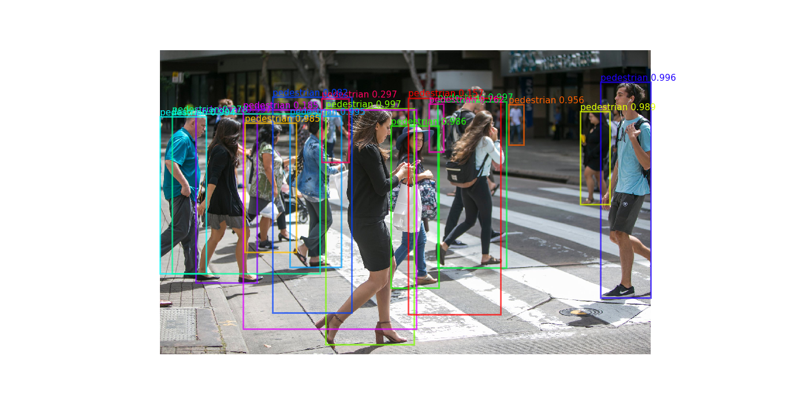
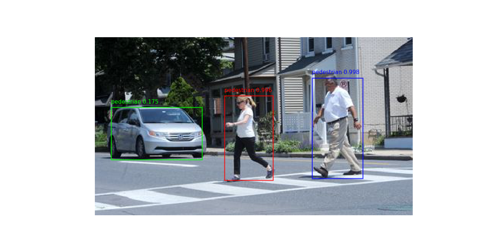
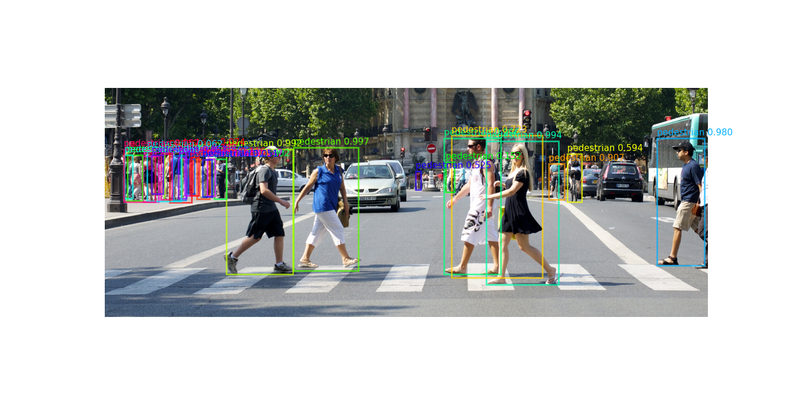
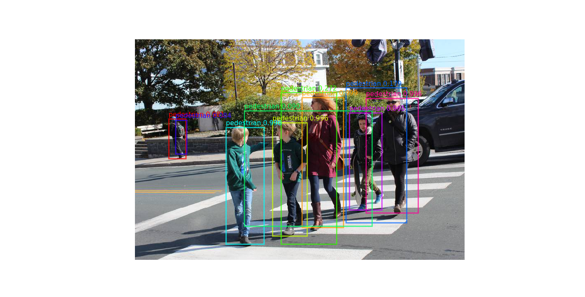
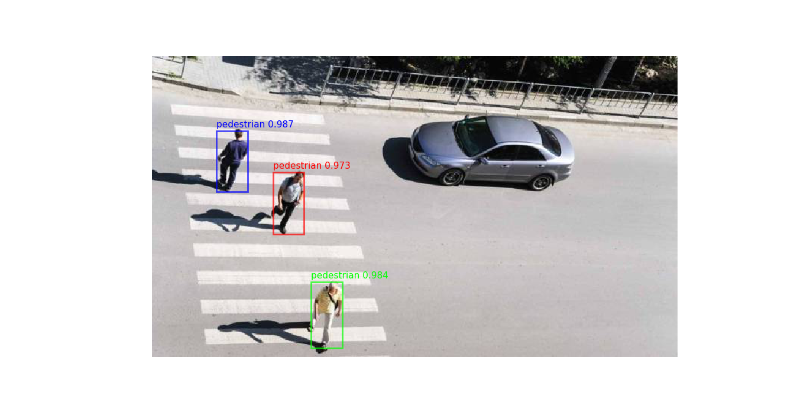

# Pedestrian Detection Using FasterRCNN_ResNet50_coco_pretrained

## Usage
```
$ python main.py -o (optimizer Adam?: str) -n (number of classes: int) -e (number of epochs: int) -sch (lr_scheduler: bool)
```

## Detection before NMS






